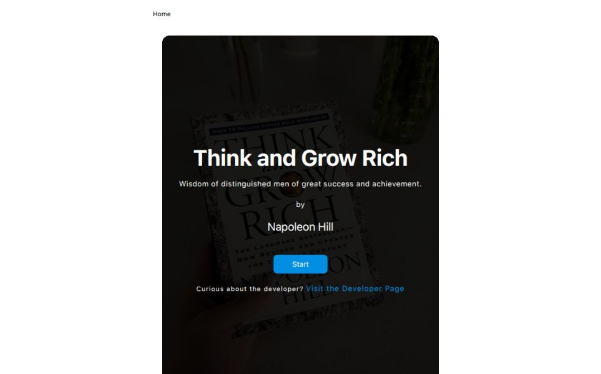

# 📚 Chapter Reader App

A modern and responsive React app that allows users to read and bookmark chapters, with clean UI, animated alerts, a floating menu, and a beautiful 404 error page. Built using React.js, Tailwind CSS, Axios, and Framer Motion.



---

## 🌟 Features

- ✅ View individual chapter details with title and description
- 📌 Add chapters to bookmarks (with visual feedback)
- 🪄 Smooth animations using Framer Motion
- 🔘 Floating action menu with navigation links
- 🧭 Custom 404 "Not Found" page
- 🔗 External links open in a new tab
- 📱 Fully responsive with mobile support

---

## 🧠 Tech Stack

- [React.js](https://vite.dev/)
- [React Router](https://reactrouter.com/)
- [Tailwind CSS](https://tailwindcss.com/)
- [Framer Motion](https://motion.dev/)
- [Lucide Icons](https://lucide.dev/)
- [JSON Server](https://think-and-grow-rich-server.onrender.com) (for mock API)

---

## 🔧 Installation

### 1. Clone the Repository

```bash
git clone https://github.com/ibhimwhar/Think-and-Grow-Rich-client.git
cd Think-and-Grow-Rich-client
npm install
npm run dev